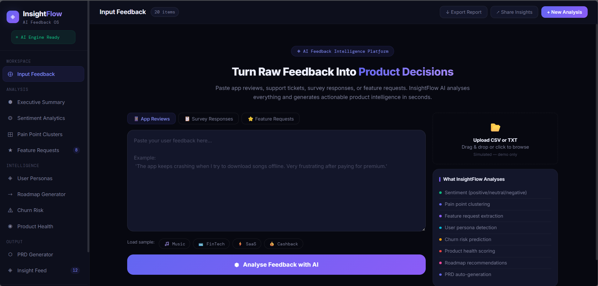
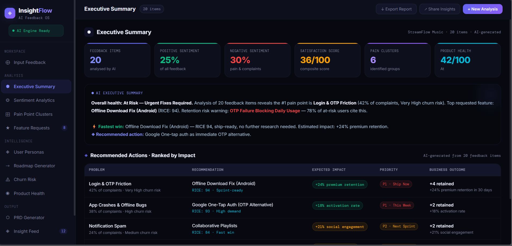

# InsightFlow — AI Product Feedback Intelligence Platform

InsightFlow is an AI-powered Product Feedback Intelligence Platform designed to help product teams analyze customer feedback, detect pain points, prioritize features, and generate product insights.

Built as a simulation of a modern AI product operations dashboard used by startups and SaaS companies.

---

# Live Demo
https://insightflow-intelligence.netlify.app/

---

# Overview

InsightFlow transforms raw customer feedback into actionable product intelligence.

The platform analyses:
- app reviews
- customer complaints
- support tickets
- feature requests
- survey responses

It generates:
- sentiment analytics
- pain point clustering
- feature prioritization
- churn risk insights
- roadmap recommendations
- AI-generated PRDs

The project uses dynamic simulated datasets to create realistic PM and product analytics workflows without backend infrastructure.

---

# Features

## AI Executive Summary
Generate:
- overall product insights
- major user frustrations
- retention risks
- growth opportunities
- AI-generated recommendations

---

## Sentiment Analytics Dashboard
Track:
- positive/neutral/negative sentiment
- satisfaction trends
- frustration levels
- emotion scoring

Includes interactive visualizations and analytics cards.

---

## Pain Point Clustering
Automatically groups repeated complaints into clusters such as:
- onboarding friction
- app crashes
- payment failures
- notification spam
- UI confusion

Includes:
- severity scoring
- churn risk indicators
- affected user segments
- complaint frequency

---

## Feature Request Intelligence
Analyze:
- feature demand
- priority scoring
- effort estimation
- impact analysis

Includes:
- RICE scoring
- MoSCoW prioritization
- sprint recommendations

---

## User Persona Detection
Identify user segments such as:
- students
- power users
- premium customers
- enterprise teams
- first-time users

Analyze:
- engagement behavior
- churn likelihood
- top complaints
- feature demand

---

## Product Roadmap Generator
Generate:
- immediate fixes
- next sprint priorities
- long-term improvements

Presented in a Kanban-style roadmap interface.

---

## AI PRD Generator
Generate:
- problem statements
- user stories
- success metrics
- rollout considerations
- product requirements

---

## Product Health Score
Track:
- satisfaction score
- retention risk
- feature-market fit
- product quality indicators

---

## Churn Risk Analysis
Identify:
- risky user journeys
- retention opportunities
- high-friction experiences
- churn drivers

---

# Dynamic Data System

InsightFlow uses dynamic simulated datasets and AI-style workflow logic.

Every analysis dynamically generates:
- sentiment insights
- complaint clusters
- feature priorities
- roadmap suggestions
- churn predictions
- product intelligence summaries

This creates realistic PM/product operations simulations without requiring backend infrastructure.

---

# Tech Stack

- HTML
- CSS
- JavaScript
- Chart.js

---

# Screenshots

## Input Feedback Screen

## Executive Summary

## Sentiment Analytics Dashboard

---

# Key Product Questions Solved

InsightFlow helps answer questions like:

- What frustrates users the most?
- Which features should be prioritized?
- Which users are likely to churn?
- What improvements create the highest impact?
- Which issues should teams fix first?
- What should the next sprint roadmap include?

---

# Why I Built This

I built InsightFlow to explore:
- AI-assisted product operations
- product management workflows
- user feedback analysis
- feature prioritization
- PM decision-making systems

The goal was to simulate how modern product teams use AI to better understand users and improve product strategy.

---

